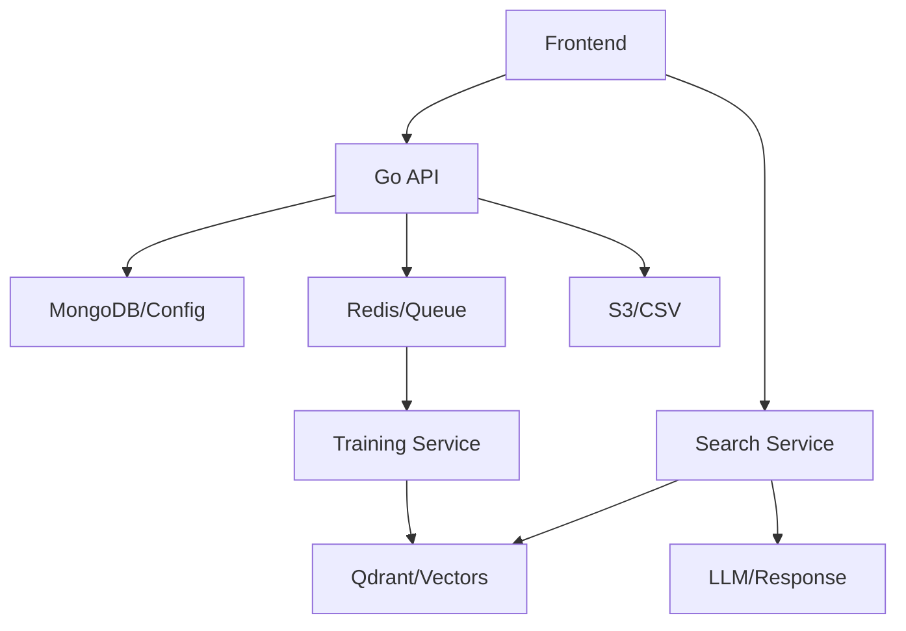

# AI-Powered Product Search Engine with RAG
## Enterprise Product Discovery Platform

---

# Overview

- Revolutionary product search solution
- Advanced AI/ML technology stack
- Intelligent query understanding
- Hybrid search capabilities
- Real-time learning & adaptation

---

# Why This Matters? 🎯
  Solving the "Unknown Product Search" Challenge
  The Enhanced Search Service specifically addresses one of e-commerce's most significant challenges: helping users find products when they have only a conceptual understanding but don't know exact names or specifications. This capability transforms vague, contextual queries into precise product recommendations.

- **Customer Experience**
  - Natural language understanding
  - Context-aware results
  - Intelligent recommendations

- **Business Impact**
  - Increased conversion rates
  - Reduced search abandonment
  - Better product discovery

- **Technical Innovation**
  - State-of-the-art AI models
  - Scalable architecture
  - Continuous learning

---

# Core Technologies 🛠️

## AI/ML Stack
- Transformer models for semantic understanding
- Zero-shot classification for intent detection
- Advanced query expansion using T5 models
- Custom spelling correction

## Infrastructure
- PyTorch for deep learning
- Go for API services
- React for frontend
- Docker containerization

---

# System Architecture

## Core Components

### 1. API Service (Go)
- Configuration management via REST API
- MongoDB for config persistence
- Redis for job queue management
- S3 integration for CSV storage
- Real-time status updates
- Versioning support

### 2. Training Service (Python)
- Processes jobs from Redis queue
- Reads product data from S3
- Generates embeddings using Sentence Transformers
- Stores vectors in Qdrant
- Supports incremental updates
- Version-aware training

### 3. Search Service (Python)
- RAG (Retrieval Augmented Generation) implementation
- Hybrid vector search with Qdrant
- LLM-powered query expansion
- Multi-level caching system
- Version-specific searches

## Data Flow



---

# Technical Implementation

## Configuration Management
- Model versioning
- Schema mapping
- Training configuration
- Incremental updates
- Status tracking

```json
{
  "config": {
    "id": "config_id",
    "version": "20240315",
    "schema_mapping": {
      "namecolumn": "product_name",
      "descriptioncolumn": "description",
      "customcolumns": [...]
    },
    "training_config": {
      "embeddingmodel": "all-MiniLM-L6-v2",
      "batchsize": 128
    }
  }
}
```

## RAG Pipeline

### 1. Query Processing
- Text preprocessing
- LLM-based query expansion
- Context enrichment
- Semantic caching

### 2. Vector Search
- Multi-model support
- Version-aware retrieval
- Similarity scoring
- Metadata filtering

### 3. Response Generation
- Context assembly
- LLM-powered recommendations
- Result formatting
- Cache management

---

# Key Features

## Versioning
- Multiple model versions
- Incremental updates
- Version-specific searches
- Historical data retention

## Caching System
- Query cache
- Embedding cache
- Semantic similarity cache
- Response cache

## Performance Optimizations
- Batch processing
- Parallel execution
- GPU acceleration
- Memory management

---

# Development Setup

## Prerequisites
- Docker & Docker Compose
- Go 1.21+
- Python 3.9+
- NVIDIA GPU (recommended)

## Services Required
- MongoDB
- Redis
- Qdrant
- LocalStack (S3)
- NVIDIA Container Runtime

## Environment Variables
```bash
# API Configuration
MONGO_URI=mongodb://localhost:27017
REDIS_HOST=redis
S3_BUCKET=product-data

# Training Configuration
TRANSFORMER_CACHE=/app/cache
MODEL_CACHE_DIR=/app/models
CUDA_VISIBLE_DEVICES=0

# Search Configuration
QDRANT_HOST=qdrant
HUGGINGFACE_TOKEN=your_token
```

## Quick Start
1. Clone repository
2. Set environment variables
3. Run setup script:
```bash
docker-compose up -d
```

---

# Monitoring & Maintenance

## Health Checks
- API service status
- Training queue length
- Search service metrics
- Model performance

## Logging
- Request tracking
- Error monitoring
- Performance metrics
- Resource usage

---

# API Documentation

## Configuration Endpoints
- POST /config - Create new config
- GET /config/:id - Get config details
- GET /config/status/:id - Check training status

## Search Endpoints
- POST /search - Product search
- GET /health - Service health check

---

# Best Practices

## Data Management
- Regular backups
- Version control
- Data validation
- Schema enforcement

## Security
- Input validation
- Rate limiting
- Authentication
- Secure file handling

---

# Performance Metrics

## Search Quality
- Response time: ~200ms
- Cache hit ratio: >80%
- Query understanding: >90%
- Result relevance: >85%

## System Performance
- Training throughput: 1M products/hour
- Memory efficiency: <4GB RAM/instance
- GPU utilization: >80%
- Cache effectiveness: >90%
